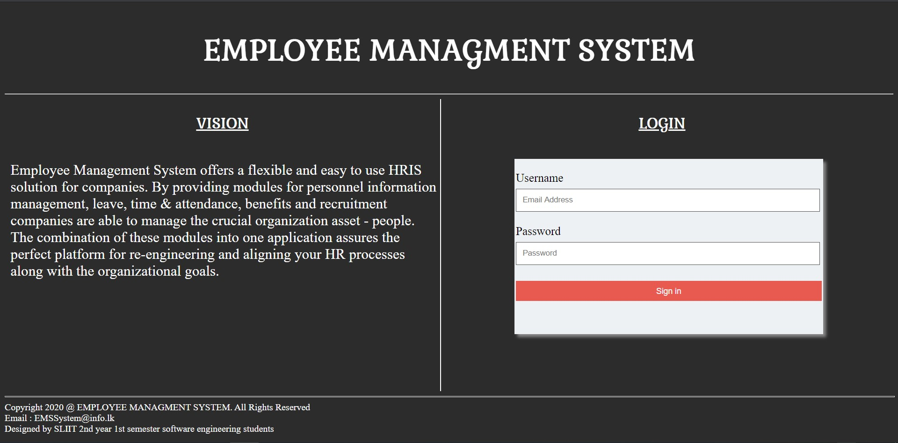
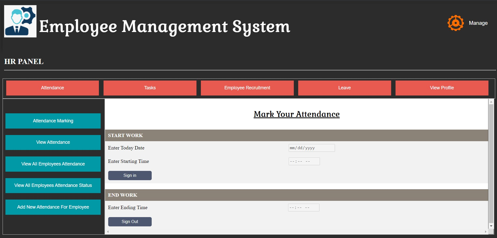
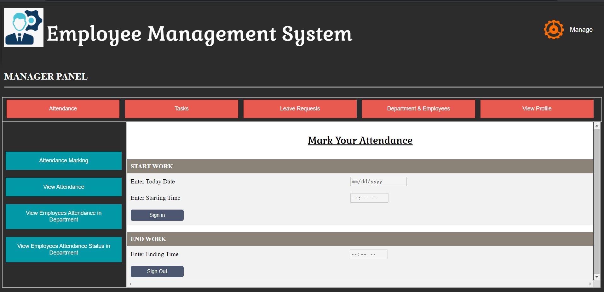
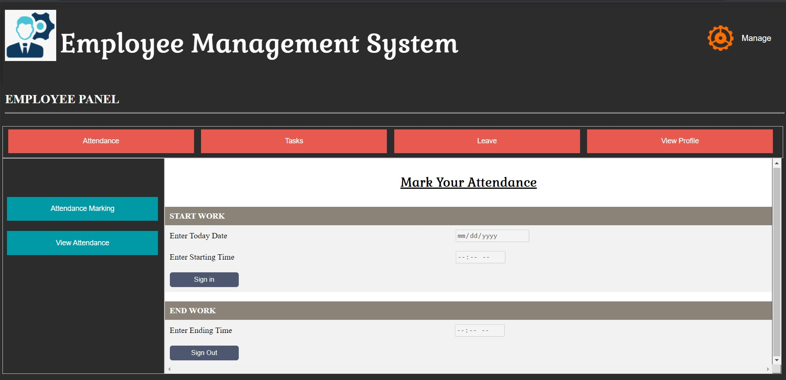
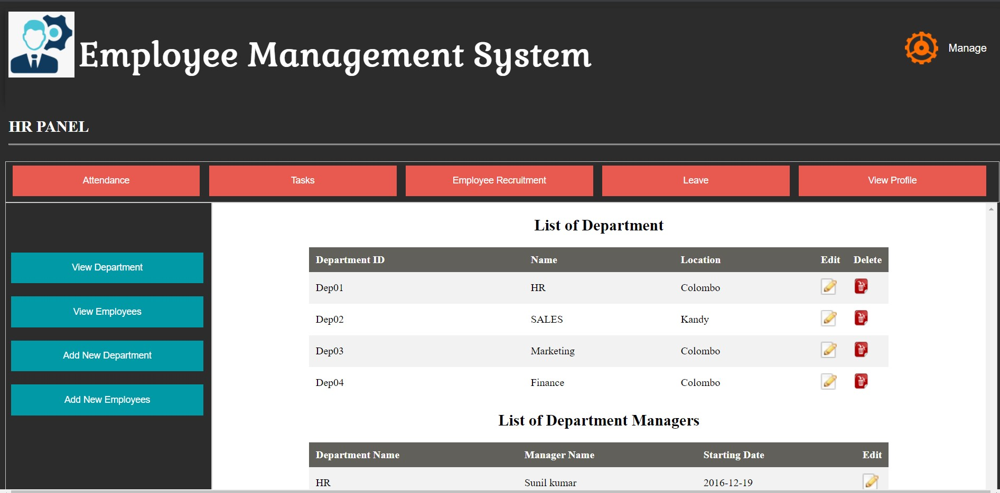
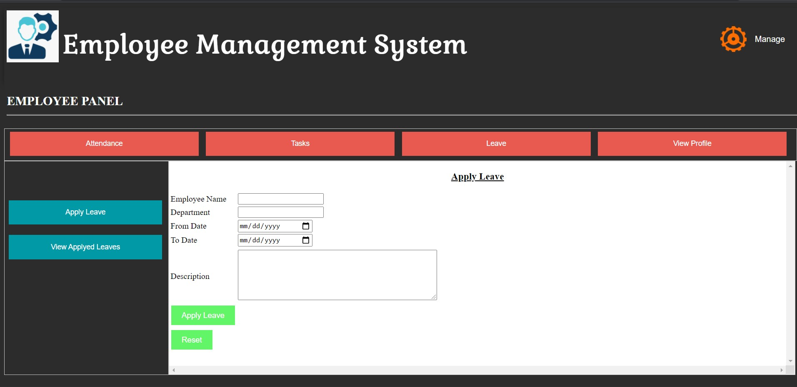
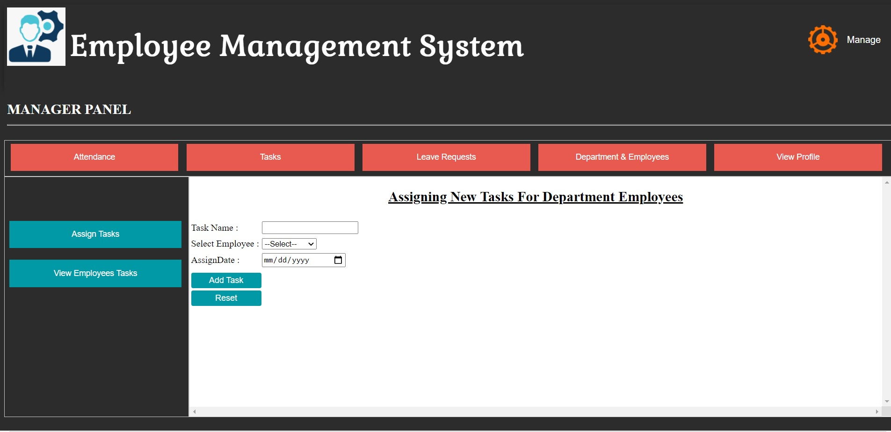
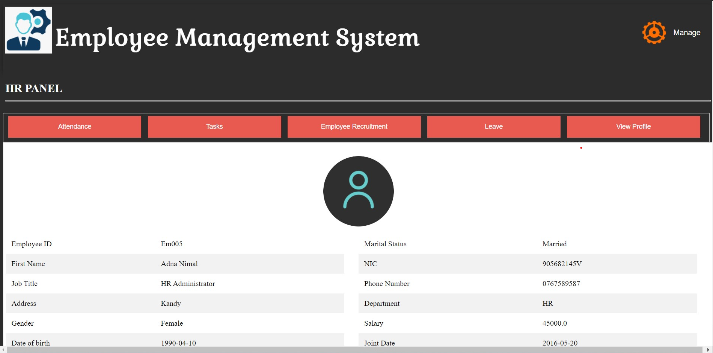

# Employee Managment System

## Table of Contents
* [Introduction](#intro-project)
* [Technologies](#tech)
* [Project Screenshots](#pro)
* [Requirements](#req)
* [Setup](#setup)
* [Team Members](#team-members)
* [Contact](#cont)

## Introduction

This Employee Management System offers a flexible and easy to use HR solution for companies. By designing this system, we can store and manage important personal details of an employee in a secure way and manage employees Task, leave, time & attendance, benefits and recruitments. companies are able to manage the crucial organization asset - people. The combination of these modules into one application assures the perfect platform for re-engineering and aligning your HR processes along with the organizational goals.

## Technologies

Technologies used to create the project
* Front-end : JSP
* Back-end : Servlet
* Database : MySQL 8.0

## Project Screenshots
Example System Screenshots

#### Login page

#### First pages when login as HR, Manager and Employee

#### User profile

## Requirements
Required softwares to run the project
* Apache Tomcat Server 8.5 or higher
* MySQL 8.0 or higher
* Eclipse Enterprise IDE

## Setup

1. Clone the Repository in Eclipse IDE
2. Setup tomcat server
3. Configure runtime of tomcat server
4. Setup MySQL databse in eclipse IDE
5. Configure username and password for Database connection in DBconnection.class file
    - Configuration file path located in the project = src -> com.ems.util package -> DBConnection.java
6. Run the SQL query file in the MySQL database to add database tables
    - SQL query file path located in the project = WebContent -> WEB-INF -> DatabaseTableQueries.sql
8. Run the project in IDE
9. Project will be deployed and run in the tomcatserver 

## Team Members

* M.N.M Akeel (Team leader) - [@AkeelMNM](https://github.com/AkeelMNM)
* M.A.M Nusky - [@nushkymohamed](https://github.com/nushkymohamed)
* P.M.F.A Ahamed - [@Track-suite](https://github.com/Track-suite)
* Zumry.A.M - [@Zumry](https://github.com/Zumry)

## Contact

- M.N.M Akeel - <akeel1447@gmail.com>
- A.M Zumry - <amzumry@gmail.com>
